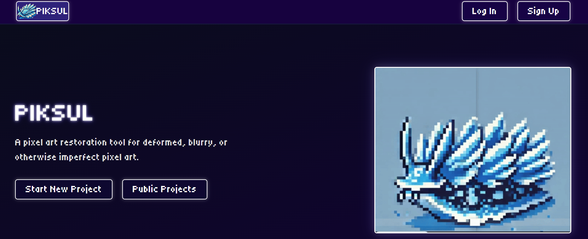
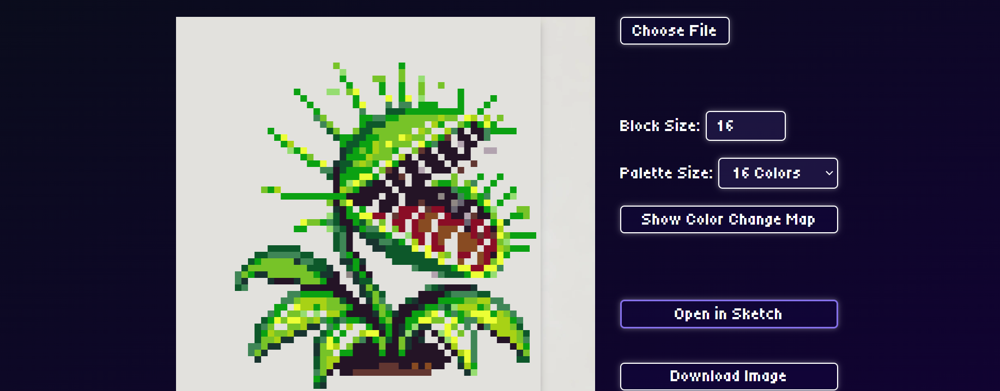
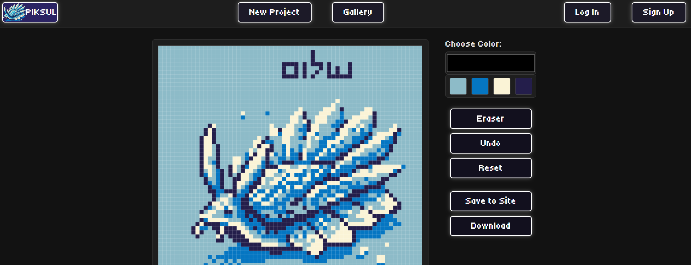

To view my self-hosted project, navigate to [katan.axolotl-acrux.ts.net](https://katan.axolotl-acrux.ts.net/)

# Piksul

Piksul is a pixel art reconstruction and deartifacting tool that uses modified run-length encoding and variance analysis to restore deformed or blurry pixel art to its original grid alignment. It automates the challenging aspects of editing existing pixel art, including grid alignment, block size determination, and artifact removal caused by data loss or AI-generated distortions.
The editor page performs automatic calculations, grid-snapping, and allows palette quantization. Projects can be transferred to the Sketch page for manual refinement, with project data (e.g., block size, palette colors) updated and transferred via local storage. From either editor, projects can be saved to the server and displayed in the gallery for retrieval and continued editing.
 

## Tech Stack

Piksul is built with a Node/Express.js backend, self-hosted SQLite and image filesystem for data storage, and Passport for user authentication features (in development). Custom algorithms calculate and self-evaluate the pixel block size.

## How to Run

Clone the repository and navigate to the project directory. Install dependencies with `npm install`. Run with "npm start" or "node --watch server.js"

Run the server using `node server.js`. Access the application at `http://localhost:8000`. Upload pixel art images for analysis and reconstruction, adjust settings, and save or export the results. To see publically saved projects, navigate to the Public Projects Gallery!