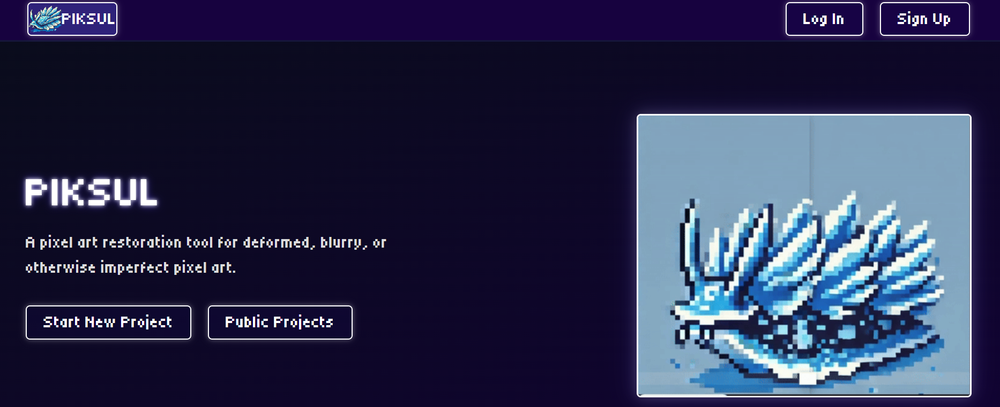
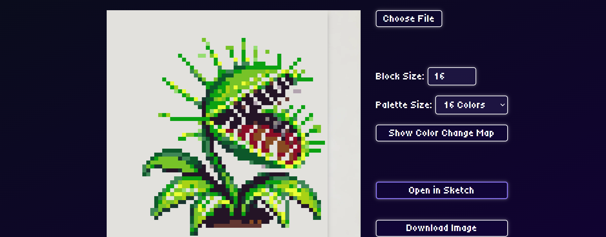
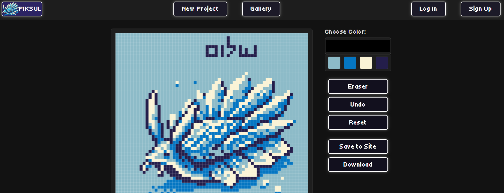

To view my self-hosted project, navigate to [katan.axolotl-acrux.ts.net](https://katan.axolotl-acrux.ts.net/)

# Piksul

Piksul is a pixel art reconstruction and deartifacting tool that applies modified run-length encoding and variance analysis to restore deformed or blurry pixel art to its intended grid alignment, with additional manual editing and project management features. It simplifies the hard part of editing pixel art- the grid alignment, determination of block size, and the removal of artifacts from data loss or AI.
 

## Tech Stack

Piksul is built with a Node/Express.js backend, self-hosted SQLite and image filesystem for data storage, and Passport for user authentication features (in development). Custom algorithms calculate and self-evaluate the pixel block size.

## How to Run

Clone the repository and navigate to the project directory. Install dependencies with `npm install`. Run with "npm start" or "node --watch server.js"

Run the server using `node server.js`. Access the application at `http://localhost:8000`. Upload pixel art images for analysis and reconstruction, adjust settings, and save or export the results. To see publically saved projects, navigate to the Public Projects Gallery!